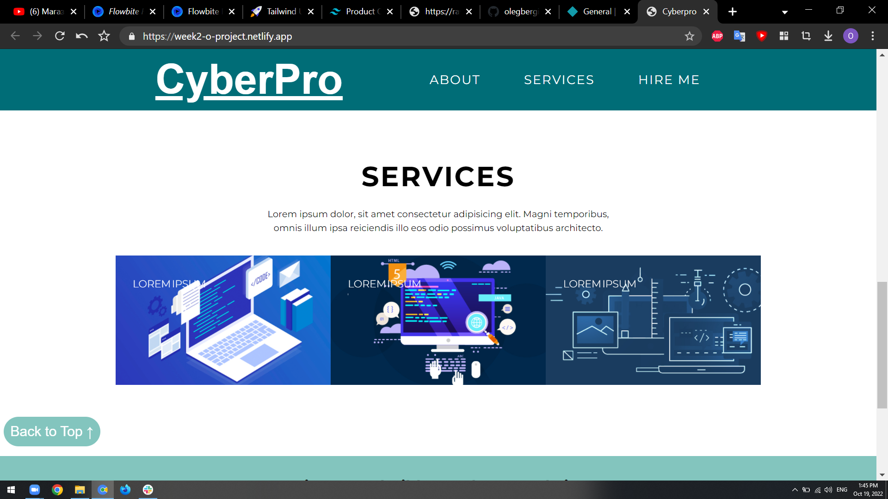

# week2_project
# project portfolio
## my fullstack course second project 
 
 https://week2-o-project.netlify.app/
 
 my second website project as part of a fullstack developer course with html/css

***

## Running the project

1. Clone the repo.
2. open with live server

***

## Technologies:

### clinet-side:
html
css

***
